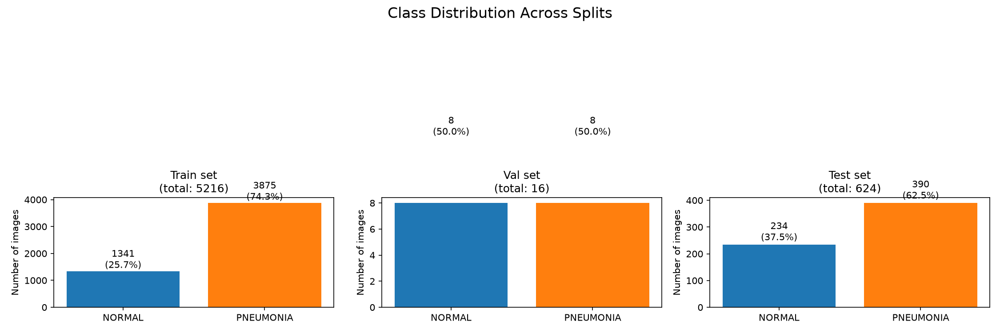
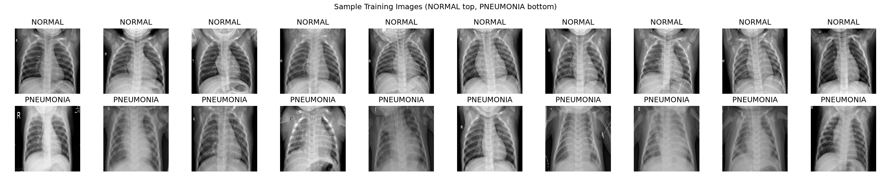
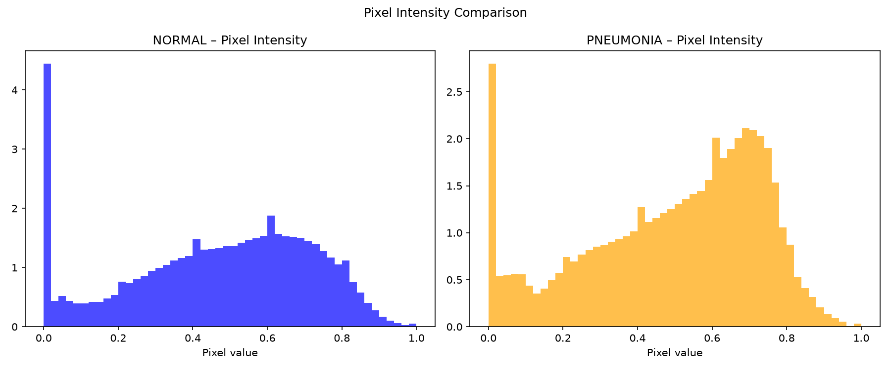
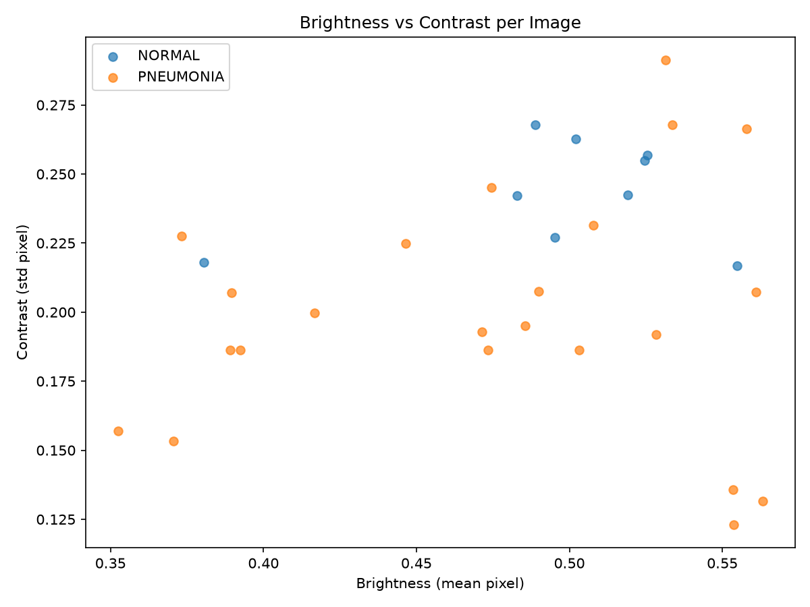

# Chest X-Ray Pneumonia Classification (CNN)

A convolutional neural network built with TensorFlow/Keras to classify pediatric chest X-ray images as **NORMAL** or **PNEUMONIA**, using the classic Kermany et al. Chest X-Ray dataset structure (`train/val/test`, each split into `NORMAL/` and `PNEUMONIA/` subfolders).

## Overview

This notebook covers the full pipeline:

1. **Configuration** — paths, image size, batch size, epochs, seed
2. **Data loading** — `ImageDataGenerator` pipelines for train (with augmentation) and val/test (rescale only)
3. **Exploratory Data Analysis (EDA)** — class balance, sample images, pixel intensity histograms, per-class mean/std images, brightness vs. contrast scatter, and augmentation previews
4. **Class weighting** — balanced class weights to handle class imbalance
5. **Model** — a 4-block Conv2D + BatchNorm + MaxPooling CNN with global average pooling and a dense classification head
6. **Callbacks** — early stopping, learning-rate reduction on plateau, and best-model checkpointing
7. **Training** — 5 epochs on the training set with validation monitoring
8. **Evaluation** — classification report, confusion matrix, ROC-AUC on the held-out test set
9. **Training curves** — accuracy/loss/AUC plotted across epochs and saved to disk

## Dataset

Expected folder structure:

```
<DATA_DIR>/
├── train/
│   ├── NORMAL/
│   └── PNEUMONIA/
├── val/
│   ├── NORMAL/
│   └── PNEUMONIA/
└── test/
    ├── NORMAL/
    └── PNEUMONIA/
```

This project is built for the [Chest X-Ray Images (Pneumonia)](https://www.kaggle.com/datasets/paultimothymooney/chest-xray-pneumonia) dataset (Kermany et al.). The dataset itself is **not included** in this repo — download it separately and set the path via the `CHEST_XRAY_DATA_DIR` environment variable (see below), or edit the `DATA_DIR` default in the notebook.

Dataset sizes used in this run:

| Split | NORMAL | PNEUMONIA | Total |
|-------|-------:|----------:|------:|
| Train | 1,341  | 3,875     | 5,216 |
| Val   | 8      | 8         | 16    |
| Test  | 234    | 390       | 624   |



### Sample Images



## Exploratory Data Analysis

**Pixel intensity distributions** — NORMAL vs. PNEUMONIA pixel value histograms:



**Mean and standard deviation images per class** — the "average" X-ray for each class, and pixel-wise variability:


**Brightness vs. contrast** — per-image mean pixel value vs. pixel std deviation:



**Augmentation preview** — example transforms applied by the training data generator (rotation, shift, shear, zoom, brightness, horizontal flip):


## Model Architecture

A sequential CNN (~422K trainable params):

```
Input (150, 150, 3)
→ [Conv2D(32) → BatchNorm → MaxPool] 
→ [Conv2D(64) → BatchNorm → MaxPool]
→ [Conv2D(128) → BatchNorm → MaxPool]
→ [Conv2D(256) → BatchNorm → MaxPool]
→ GlobalAveragePooling2D
→ Dense(128, relu) → Dropout(0.4)
→ Dense(1, sigmoid)
```

- **Loss:** binary cross-entropy
- **Optimizer:** Adam (lr = 1e-3, reduced on plateau)
- **Metrics:** accuracy, AUC
- **Class weighting:** balanced (to offset the ~3:1 PNEUMONIA:NORMAL train ratio)
- **Regularization:** BatchNorm + Dropout(0.4); EarlyStopping (patience 6, restores best weights)

## Results

Test set (624 images):

| Metric | Value |
|---|---|
| Test Accuracy | 0.6346 |
| ROC AUC | 0.7608 |
| PNEUMONIA Recall (sensitivity) | 0.9487 |
| NORMAL Recall | 0.1111 |

```
              precision    recall  f1-score   support
      NORMAL     0.5652    0.1111    0.1857       234
   PNEUMONIA     0.6401    0.9487    0.7645       390
```

Training curves are generated by the notebook and saved as `Output/training_curves.png` after training.

**Note:** The validation set in this dataset split is very small (16 images), which makes `val_loss`/`val_accuracy` noisy and an unreliable signal for early stopping / checkpointing — this shows up as the erratic validation curves in `training_curves.png`. The model also currently under-performs on the NORMAL class (low recall), likely driven by that tiny, unrepresentative validation set combined with the class imbalance. If you plan to build on this, consider re-splitting train/val (e.g. carving a larger, stratified validation set out of train) and/or fine-tuning a pretrained backbone (e.g. ResNet/EfficientNet transfer learning) instead of training a CNN from scratch.

## Repository Contents

```
├── Image_Classification.ipynb   # Main notebook (EDA → training → evaluation)
├── Output/                      # Generated EDA and training plots
│   ├── class_distribution.png   # Class balance across train/val/test
│   ├── sample_images.png        # Sample NORMAL vs PNEUMONIA training images
│   ├── pixel_histograms.png     # Pixel intensity distributions per class
│   ├── mean_std_images.png      # Mean/std "average" X-ray per class
│   ├── brightness_contrast.png  # Brightness vs. contrast scatter per image
│   ├── augmented_samples.png    # Preview of augmentation transforms
│   └── training_curves.png      # Generated after training: accuracy / loss / AUC
└── chest_xray_cnn_best.keras    # Best checkpoint (generated on run, not tracked in git — see below)
```

## Setup

```bash
pip install tensorflow numpy matplotlib scikit-learn jupyter
```

Set the dataset location (optional — defaults to a local path in the notebook, which you should update):

```bash
export CHEST_XRAY_DATA_DIR="/path/to/chest_xray"   # macOS/Linux
set CHEST_XRAY_DATA_DIR=C:\path\to\chest_xray       # Windows
```

Then launch the notebook:

```bash
jupyter notebook Image_Classification.ipynb
```

## Configuration

Key parameters (top of notebook, `# 1. CONFIGURATION`):

| Parameter | Value |
|---|---|
| `IMG_SIZE` | (150, 150) |
| `BATCH_SIZE` | 32 |
| `EPOCHS` | 5 |
| `LEARNING_RATE` | 1e-3 |
| `RANDOM_SEED` | 42 |

## Suggested `.gitignore`

Since the dataset and trained model weights can be large / environment-specific, consider excluding:

```
*.keras
*.h5
chest_xray/
.ipynb_checkpoints/
```

## License / Data Attribution

This project uses (but does not redistribute) the Chest X-Ray Images (Pneumonia) dataset originally published by Kermany, Zhang, and Goldbaum, and hosted on Kaggle/Mendeley Data. Please review and comply with the dataset's original license before use.
